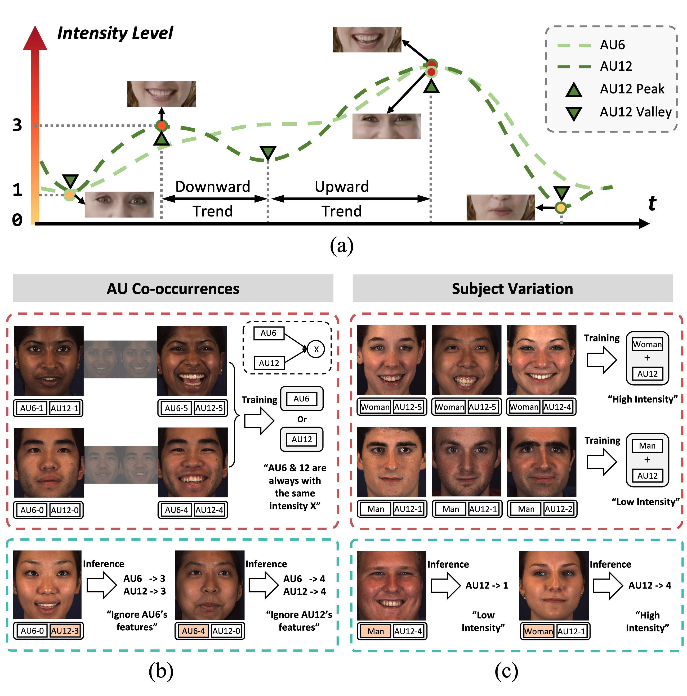
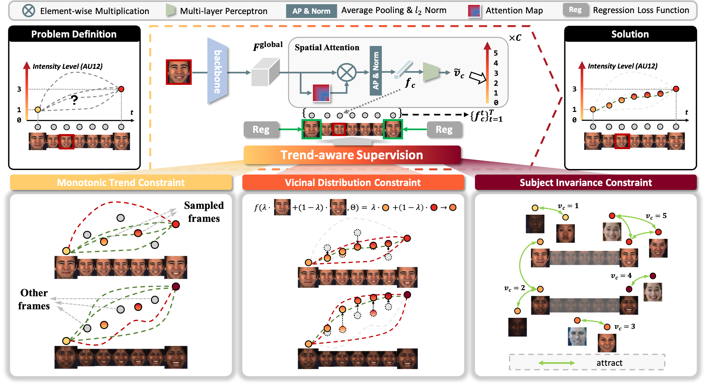

# Trend-Aware Supervision: On Learning Invariance for Semi-Supervised 057 058 Facial Action Unit Intensity Estimation

## Motivation
<p align="center">

</p>

## Overview
<p align="center">

</p>

## Dependencies
* python >= 3.6
* torch >= 1.10.0
* requirements.txt
```bash
$ pip install -r requirements.txt
```
* torchlight
```bash
$ cd $INSTALL_DIR/torchlight
$ python setup.py install
```
* R
```bash
$ conda install r-base 
$ conda install rpy2
$ R
> install.packages('psych')
> install.packages('lme4')
> quit()
```

## Data Preparation
### Step 1: Download datasets
First, request for the access of the two AU benchmark datasets: [BP4D](http://www.cs.binghamton.edu/~lijun/Research/3DFE/3DFE_Analysis.html) and [DISFA](http://mohammadmahoor.com/disfa/).

### Step 2: Preprocess raw data
Preprocess the downloaded datasets using [Dlib](http://dlib.net/) (related functions are provided in `$INSTALL_DIR/au_lib/face_ops.py`):
* Detect face and facial landmarks
* Align the cropped faces according to the computed coordinates of eye centers
* Resize faces to (256, 256)

### Step 3: Split dataset 
For BP4D, use the official spliting file in [BP4D](http://www.cs.binghamton.edu/~lijun/Research/3DFE/3DFE_Analysis.html).
For DISFA, split the subject IDs into 3 folds randomly for subject-exclusive 3-fold cross-validation (an example is provided in `$INSTALL_DIR/data/split_disfa.txt`)

### Step 4: Generate feeder input files
Our dataloader `$INSTALL_DIR/feeder/feeder_segment.py` requires two data files (an example is given in `$INSTALL_DIR/data/bp4d_example`):
* `label_path`: the path to file which contains labels ('.pkl' data), [N, 1, num_class]
* `image_path`: the path to file which contains image paths ('.pkl' data), [N, 1]
* `state_path`: the path to file which contains states ('.pkl' data), [N, 1, num_class]
* `trend_path`: the path to file which contains trends ('.pkl' data), [N, 1, num_class]

## Training 
```bash
$ cd $INSTALL_DIR
$ python run.py
```