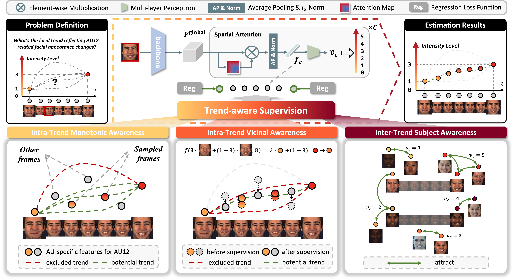

# Trend-Aware Supervision: On Learning Invariance for Semi-Supervised Facial Action Unit Intensity Estimation

Official implementation of "[Trend-Aware Supervision: On Learning Invariance for Semi-Supervised Facial Action Unit Intensity Estimation]()" (AAAI 2024).

<p align="center">

</p>

## 💡 Motivation
<p align="center">

</p>


## 🎥 Application
Please refer to <a href="https://github.com/chen-yingjie/Fine-grained-Facial-Expression-Recognition">repo</a> for more details.
<!-- <video src="assets/demo_video.mp4" style="width:100%;" poster="img/spinner.svg" autoplay muted loop></video> -->

## 🛠️ Usage
### Dependencies
```bash
git clone https://github.com/echoanran/Trend_Aware_Supervision.git $INSTALL_DIR
```
* python >= 3.6
* torch >= 1.10.0
* requirements.txt
```bash
$ pip install -r requirements.txt
```
* torchlight
```bash
$ cd $INSTALL_DIR/torchlight
$ python setup.py install
```
* R
```bash
$ conda install r-base 
$ conda install rpy2
$ R
> install.packages('psych')
> install.packages('lme4')
> quit()
```

### Data Preparation
#### Step 1: Download datasets
First, request for the access of the two AU benchmark datasets: [BP4D](http://www.cs.binghamton.edu/~lijun/Research/3DFE/3DFE_Analysis.html) and [DISFA](http://mohammadmahoor.com/disfa/).

#### Step 2: Preprocess raw data
Preprocess the downloaded datasets using [Dlib](http://dlib.net/) (related functions are provided in `$INSTALL_DIR/au_lib/face_ops.py`):
* Detect face and facial landmarks
* Align the cropped faces according to the computed coordinates of eye centers
* Resize faces to (256, 256)

#### Step 3: Split dataset 
For BP4D, use the official spliting file in [BP4D](http://www.cs.binghamton.edu/~lijun/Research/3DFE/3DFE_Analysis.html).
For DISFA, split the subject IDs into 3 folds randomly for subject-exclusive 3-fold cross-validation (an example is provided in `$INSTALL_DIR/data/split_disfa.txt`)

#### Step 4: Generate feeder input files
Our dataloader `$INSTALL_DIR/feeder/feeder_segment.py` requires two data files (an example is given in `$INSTALL_DIR/data/bp4d_example`):
* `label_path`: the path to file which contains labels ('.pkl' data), [N, 1, num_class]
* `image_path`: the path to file which contains image paths ('.pkl' data), [N, 1]
* `state_path`: the path to file which contains states ('.pkl' data), [N, 1, num_class]
* `trend_path`: the path to file which contains trends ('.pkl' data), [N, 1, num_class]

### Training 
```bash
$ cd $INSTALL_DIR
$ python run.py
```

## 🔗 Citation

If you find this code useful for your research, please use the following BibTeX entry.

```bibtex
@inproceedings{chen2024trend,
  title={Trend-Aware Supervision: On Learning Invariance for Semi-Supervised Facial Action Unit Intensity Estimation},
  author={Chen, Yingjie and Zhang, JiaRui and Wang, Tao and Liang, Yun},
  year={2024}}
```
